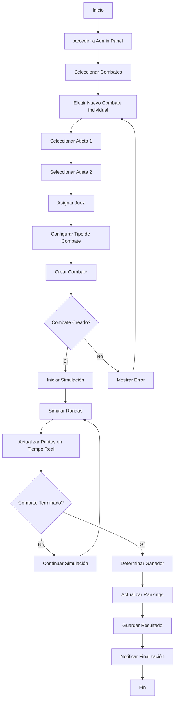
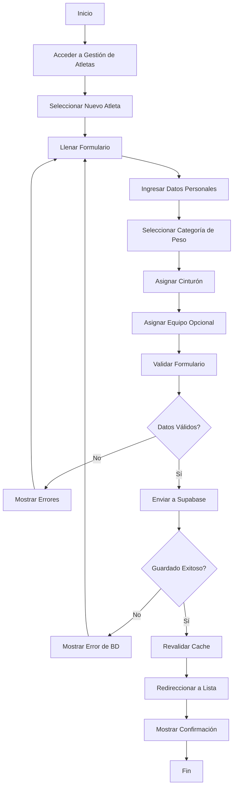
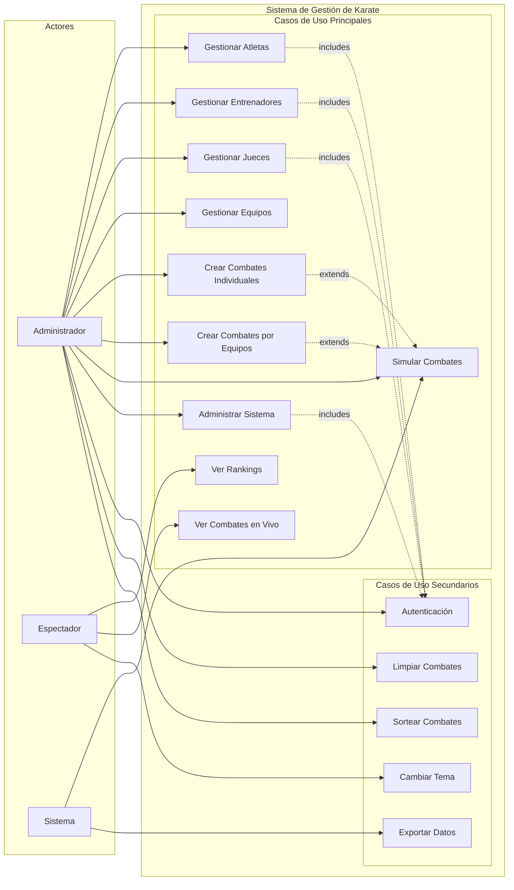
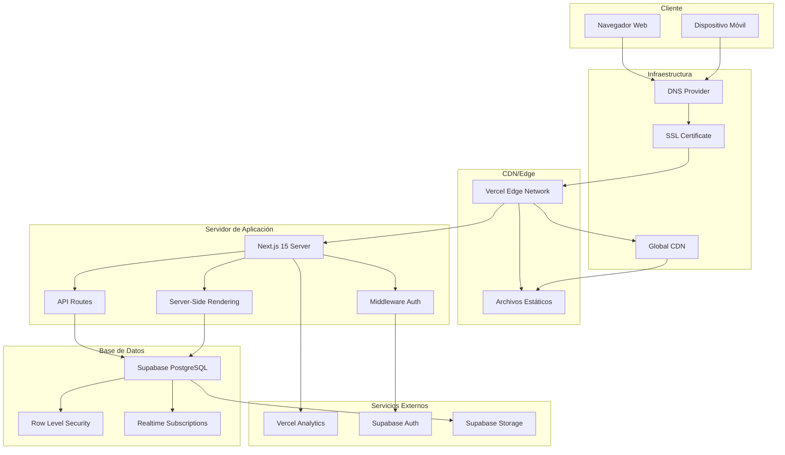

# Diagramas UML - Sistema de Gestión de Karate

## Descripción del Sistema
Sistema web de gestión para asociación de karate desarrollado con Next.js 15, Supabase, TypeScript y Tailwind CSS. Permite administrar atletas, entrenadores, jueces, equipos y combates con simulación en tiempo real.

---

## 1. Diagrama de Clases

### Entidades Principales

```mermaid
classDiagram
    class Atleta {
        +UUID id
        +string nombre
        +string apellido
        +string cedula
        +Date fecha_nacimiento
        +decimal peso
        +string categoria_peso
        +string cinturon
        +string foto_url
        +UUID equipo_id
        +boolean activo
        +DateTime created_at
        +DateTime updated_at
        +crearAtleta()
        +actualizarAtleta()
        +eliminarAtleta()
        +obtenerAtletas()
        +obtenerAtleta()
    }

    class Entrenador {
        +UUID id
        +string nombre
        +string apellido
        +string cedula
        +int anos_experiencia
        +string especialidad
        +string telefono
        +string email
        +string foto_url
        +boolean activo
        +DateTime created_at
        +DateTime updated_at
        +crearEntrenador()
        +actualizarEntrenador()
        +eliminarEntrenador()
    }

    class Equipo {
        +UUID id
        +string nombre
        +UUID entrenador_id
        +string descripcion
        +DateTime created_at
        +DateTime updated_at
        +crearEquipo()
        +actualizarEquipo()
        +obtenerEquipos()
    }

    class Juez {
        +UUID id
        +string nombre
        +string apellido
        +string cedula
        +string nivel_certificacion
        +int anos_experiencia
        +string telefono
        +string email
        +boolean activo
        +DateTime created_at
        +DateTime updated_at
        +crearJuez()
        +actualizarJuez()
        +eliminarJuez()
    }

    class CombateIndividual {
        +UUID id
        +UUID atleta1_id
        +UUID atleta2_id
        +UUID juez_id
        +string estado
        +int puntos_atleta1
        +int puntos_atleta2
        +UUID ganador_id
        +string tipo_combate
        +DateTime fecha_inicio
        +DateTime fecha_fin
        +DateTime created_at
        +crearCombate()
        +actualizarCombate()
        +eliminarCombate()
        +simularCombate()
    }

    class CombateEquipo {
        +UUID id
        +UUID equipo1_id
        +UUID equipo2_id
        +UUID juez_id
        +string estado
        +int puntos_equipo1
        +int puntos_equipo2
        +UUID ganador_id
        +DateTime fecha_inicio
        +DateTime fecha_fin
        +DateTime created_at
        +crearCombateEquipo()
        +eliminarCombateEquipo()
    }

    class SupabaseClient {
        +string url
        +string anonKey
        +createBrowserClient()
        +createServerClient()
        +from()
        +select()
        +insert()
        +update()
        +delete()
    }

    Equipo ||--o{ Atleta : tiene
    Entrenador ||--o{ Equipo : entrena
    Atleta ||--o{ CombateIndividual : participa
    Juez ||--o{ CombateIndividual : arbitra
    Equipo ||--o{ CombateEquipo : compite
    Juez ||--o{ CombateEquipo : arbitra
    SupabaseClient ||--o{ Atleta : gestiona
    SupabaseClient ||--o{ Entrenador : gestiona
    SupabaseClient ||--o{ Equipo : gestiona
    SupabaseClient ||--o{ Juez : gestiona
    SupabaseClient ||--o{ CombateIndividual : gestiona
    SupabaseClient ||--o{ CombateEquipo : gestiona
```

### Componentes de UI

```mermaid
classDiagram
    class AdminLayout {
        +ReactNode children
        +render()
    }

    class AtletaForm {
        +AtletaFormData formData
        +onSubmit()
        +validate()
        +render()
    }

    class AtletasTable {
        +Atleta[] atletas
        +onEdit()
        +onDelete()
        +render()
    }

    class CombateSimulador {
        +CombateIndividual combate
        +simularRonda()
        +actualizarPuntos()
        +finalizarCombate()
        +render()
    }

    class ThemeProvider {
        +string theme
        +toggleTheme()
        +render()
    }

    AdminLayout ||--o{ AtletaForm : contiene
    AdminLayout ||--o{ AtletasTable : contiene
    AdminLayout ||--o{ CombateSimulador : contiene
    ThemeProvider ||--o{ AdminLayout : envuelve
```

---

## 2. Diagrama de Actividades

### Proceso de Gestión de Combate Individual



### Proceso de Registro de Atleta



---

## 3. Diagrama de Casos de Uso



### Descripción de Casos de Uso

#### Casos de Uso Principales:
- **UC1 - Gestionar Atletas**: CRUD completo de atletas con validaciones
- **UC2 - Gestionar Entrenadores**: Administración de entrenadores y especialidades
- **UC3 - Gestionar Jueces**: Control de jueces y certificaciones
- **UC4 - Gestionar Equipos**: Creación y administración de equipos
- **UC5 - Crear Combates Individuales**: Configuración de combates 1v1
- **UC6 - Crear Combates por Equipos**: Configuración de combates grupales
- **UC7 - Simular Combates**: Simulación automática en tiempo real
- **UC8 - Ver Rankings**: Visualización de clasificaciones y estadísticas
- **UC9 - Administrar Sistema**: Panel de control administrativo
- **UC10 - Ver Combates en Vivo**: Seguimiento de combates activos

---

## 4. Diagrama de Despliegue



### Especificaciones Técnicas de Despliegue

#### **Frontend (Cliente)**
- **Tecnología**: Next.js 15 con React 19
- **Hosting**: Vercel con Edge Functions
- **CDN**: Vercel Edge Network global
- **Características**: SSR, SSG, ISR, Hot Reloading

#### **Backend (Servidor)**
- **API**: Next.js API Routes + Server Actions
- **Autenticación**: Supabase Auth con middleware
- **Base de Datos**: Supabase PostgreSQL
- **Tiempo Real**: Supabase Realtime para combates en vivo

#### **Infraestructura**
- **Dominio**: DNS con SSL automático
- **Escalabilidad**: Auto-scaling en Vercel
- **Monitoreo**: Vercel Analytics integrado
- **Seguridad**: RLS en Supabase + HTTPS

#### **Flujo de Datos**
1. **Cliente** → Solicitud HTTP/HTTPS
2. **Vercel Edge** → Routing y cache
3. **Next.js Server** → Procesamiento SSR/API
4. **Supabase** → Consultas de base de datos
5. **Realtime** → Updates en tiempo real
6. **Cliente** → Respuesta renderizada

---

## Tecnologías Utilizadas

### **Frontend**
- Next.js 15 (App Router)
- React 19 con TypeScript
- Tailwind CSS + Radix UI
- Framer Motion (animaciones)
- Lucide React (iconos)

### **Backend**
- Supabase (BaaS)
- PostgreSQL con RLS
- Server Actions de Next.js
- Middleware de autenticación

### **Herramientas de Desarrollo**
- TypeScript para type safety
- ESLint para calidad de código
- PostCSS para procesamiento CSS
- Zod para validación de schemas

### **Despliegue y Monitoreo**
- Vercel para hosting
- Vercel Analytics
- Git para control de versiones
- Supabase Dashboard para BD

---

## Características del Sistema

### **Funcionalidades Principales**
✅ Gestión completa de atletas, entrenadores y jueces  
✅ Sistema de equipos con asignación de entrenadores  
✅ Combates individuales y por equipos  
✅ Simulador de combates en tiempo real  
✅ Rankings y estadísticas automáticas  
✅ Panel administrativo completo  
✅ Autenticación y autorización  
✅ Tema claro/oscuro  
✅ Responsive design  

### **Características Técnicas**
✅ Server-Side Rendering (SSR)  
✅ Static Site Generation (SSG)  
✅ Real-time updates con Supabase  
✅ Type-safe con TypeScript  
✅ Componentes reutilizables  
✅ Validación de formularios  
✅ Manejo de errores robusto  
✅ Cache inteligente  
✅ SEO optimizado  

---

*Documentación generada para el Sistema de Gestión de Karate - Versión 1.0*
