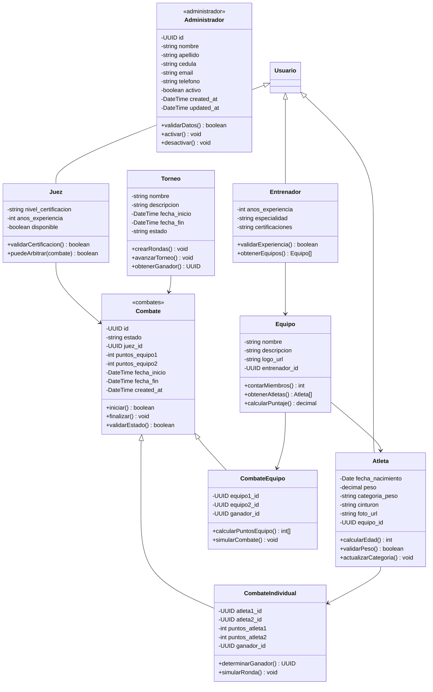
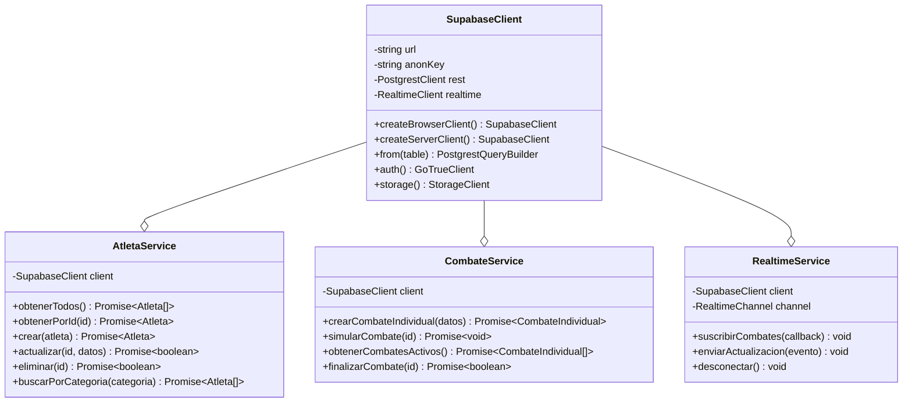
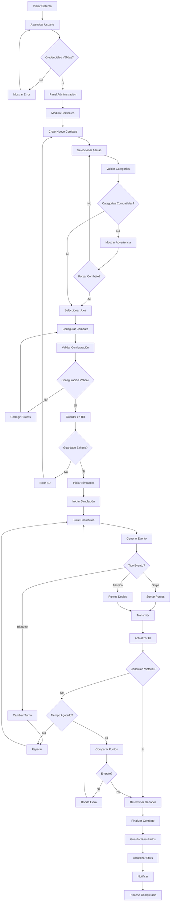
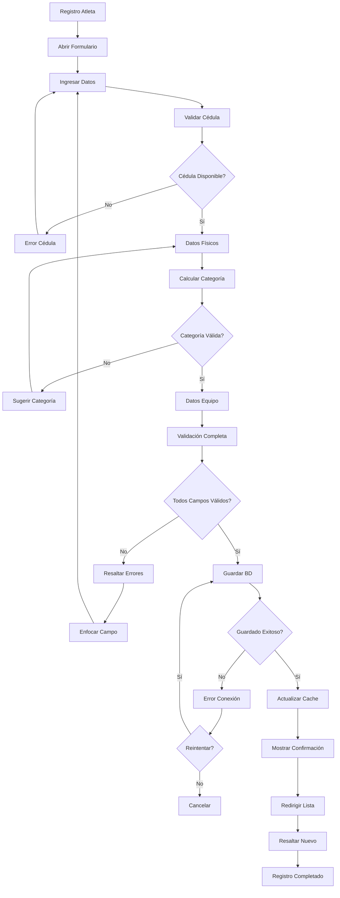
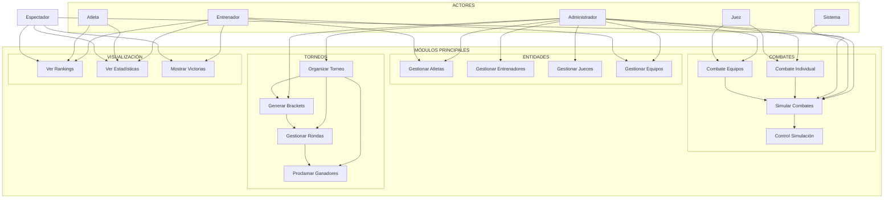
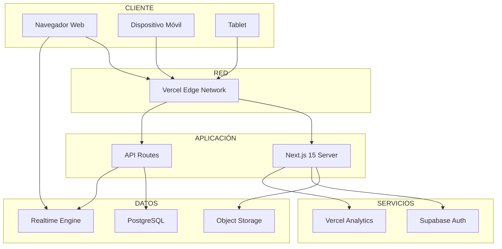

# Diagramas UML - Sistema de Gestión de Karate

## 📋 Descripción del Sistema

Sistema web integral de gestión para asociaciones de karate .. sub proyecto desarrollo de aplicaciones 2 .. profesor Franklin españa.

### Stack Tecnológico
- **Frontend**: Next.js 15, React 19, TypeScript, Tailwind CSS
- **Backend**: Supabase (PostgreSQL + Real-time + Auth)
- **Despliegue**: Vercel con Edge Network global

---

## 1. 📐 Diagrama de Clases

### 🎯 Entidades Principales del Dominio

### 🔌 Capa de Acceso a Datos y Servicios

---

## 2. 🔄 Diagrama de Actividades

### ⚔️ Proceso de Gestión de Combate Individual

### 📝 Proceso de Registro de Atleta

---

## 3. 🎭 Diagrama de Casos de Uso

---

## 4. 📦 Diagrama de Despliegue

---

## 🛠️ Tecnologías Utilizadas

### 🎨 Frontend
- Next.js 15, React 19, TypeScript
- Tailwind CSS, Radix UI
- Framer Motion, Lucide React

### ⚙️ Backend
- Supabase (PostgreSQL + Auth)
- Server Actions de Next.js

### 🚀 Despliegue
- Vercel para hosting
- Git para control de versiones

---

## ✨ Características

### Funcionalidades Principales
✅ Gestión completa de atletas y equipos  
✅ Combates individuales y por equipos  
✅ Simulador en tiempo real  
✅ Rankings y estadísticas  
✅ Panel administrativo completo  

### Características Técnicas
✅ Server-Side Rendering  
✅ Real-time updates  
✅ Type-safe con TypeScript  
✅ Responsive design  

---

*© 2025 Sistema de Gestión de Karate - Ingeniería en Informática*
