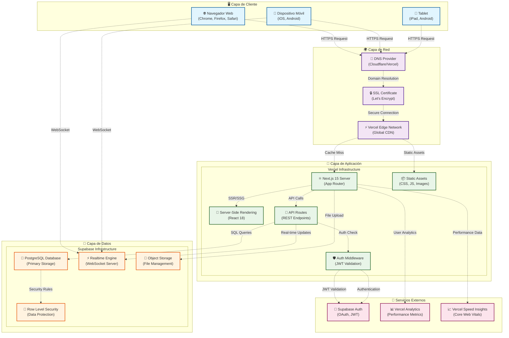

# Diagramas UML - Sistema de Gestión de Karate

## 📋 Descripción del Sistema

Este documento contiene la documentación completa de los **Diagramas UML** del Sistema de Gestión de Karate, una aplicación web moderna desarrollada con tecnologías de vanguardia.

### Sobre el Sistema
Sistema web integral de gestión para asociaciones de karate que permite:
- **Gestión de Entidades**: Administración completa de atletas, entrenadores, jueces y equipos
- **Gestión de Combates**: Creación y simulación de combates individuales y por equipos
- **Monitoreo en Tiempo Real**: Seguimiento de combates activos con actualizaciones instantáneas
- **Análisis y Reportes**: Rankings, estadísticas y reportes detallados

### Stack Tecnológico
- **Frontend**: Next.js 15, React 19, TypeScript, Tailwind CSS
- **Backend**: Supabase (PostgreSQL + Real-time + Auth)
- **Despliegue**: Vercel con Edge Network global
- **Características**: SSR/SSG, WebSockets, PWA-ready

### Propósito de este Documento
Este documento presenta cuatro tipos de diagramas UML que modelan diferentes aspectos del sistema:
1. **Diagramas de Clases**: Estructura estática del sistema
2. **Diagramas de Actividades**: Flujos de procesos y comportamientos
3. **Diagramas de Casos de Uso**: Interacciones entre actores y sistema
4. **Diagramas de Despliegue**: Arquitectura de infraestructura y componentes

---

## 📑 Tabla de Contenidos

1. [📐 Diagrama de Clases](#1--diagrama-de-clases)
   - [🎯 Entidades Principales del Dominio](#-entidades-principales-del-dominio)
   - [🔌 Capa de Acceso a Datos y Servicios](#-capa-de-acceso-a-datos-y-servicios)
   - [🎨 Componentes de Interfaz de Usuario](#-componentes-de-interfaz-de-usuario)

2. [🔄 Diagrama de Actividades](#2--diagrama-de-actividades)
   - [⚔️ Proceso de Gestión de Combate Individual](#️-proceso-de-gestión-de-combate-individual)
   - [📝 Proceso de Registro de Atleta](#-proceso-de-registro-de-atleta)
   - [⚡ Proceso de Simulación de Combate en Tiempo Real](#-proceso-de-simulación-de-combate-en-tiempo-real)

3. [🎭 Diagrama de Casos de Uso](#3--diagrama-de-casos-de-uso)
   - [👥 Actores del Sistema](#-actores-del-sistema)
   - [📊 Especificación Detallada de Casos de Uso](#-especificación-detallada-de-casos-de-uso)

4. [📦 Diagrama de Despliegue](#4--diagrama-de-despliegue)
   - [🏛️ Arquitectura de Infraestructura](#️-arquitectura-de-infraestructura)
   - [🔧 Especificaciones Técnicas del Despliegue](#-especificaciones-técnicas-del-despliegue)

5. [🛠️ Tecnologías Utilizadas](#️-tecnologías-utilizadas)

6. [✨ Características del Sistema](#-características-del-sistema)

---

## 1. 📐 Diagrama de Clases

El diagrama de clases muestra la estructura estática del sistema, incluyendo las entidades del dominio, sus atributos, métodos y relaciones.

### 🎯 Entidades Principales del Dominio

Estas clases representan los conceptos centrales del negocio: atletas, entrenadores, equipos, jueces y combates.

classDiagram
    class Usuario {
        <<Abstract>>
        -UUID id
        -string nombre
        -string apellido
        -string cedula
        -string email
        -string telefono
        -boolean activo
        -DateTime created_at
        -DateTime updated_at
        +validarDatos() boolean
        +activar() void
        +desactivar() void
    }

    class Atleta {
        -Date fecha_nacimiento
        -decimal peso
        -string categoria_peso
        -string cinturon
        -string foto_url
        -UUID equipo_id
        +calcularEdad() int
        +validarPeso() boolean
        +actualizarCategoria() void
    }

    class Entrenador {
        -int anos_experiencia
        -string especialidad
        -string certificaciones
        +validarExperiencia() boolean
        +obtenerEquipos() Equipo[]
    }

    Usuario <|-- Atleta
    Usuario <|-- Entrenador
    Usuario <|-- Juez
    
    Entrenador --> Equipo
    Equipo --> Atleta
    
    Combate <|-- CombateIndividual
    Combate <|-- CombateEquipo
    
    Juez --> Combate
    Atleta --> CombateIndividual
    Equipo --> CombateEquipo
    Torneo --> Combate

### 🔌 Capa de Acceso a Datos y Servicios

Estas clases manejan la comunicación con Supabase y encapsulan la lógica de acceso a datos.

```mermaid
classDiagram
    class SupabaseClient {
        -string url
        -string anonKey
        -PostgrestClient rest
        -RealtimeClient realtime
        +createBrowserClient() SupabaseClient
        +createServerClient() SupabaseClient
        +from(table) PostgrestQueryBuilder
        +auth() GoTrueClient
        +storage() StorageClient
    }

    class AtletaService {
        -SupabaseClient client
        +obtenerTodos() Promise~Atleta[]~
        +obtenerPorId(id) Promise~Atleta~
        +crear(atleta) Promise~Atleta~
        +actualizar(id, datos) Promise~boolean~
        +eliminar(id) Promise~boolean~
        +buscarPorCategoria(categoria) Promise~Atleta[]~
    }

    class CombateService {
        -SupabaseClient client
        +crearCombateIndividual(datos) Promise~CombateIndividual~
        +simularCombate(id) Promise~void~
        +obtenerCombatesActivos() Promise~CombateIndividual[]~
        +finalizarCombate(id) Promise~boolean~
    }

    class RealtimeService {
        -SupabaseClient client
        -RealtimeChannel channel
        +suscribirCombates(callback) void
        +enviarActualizacion(evento) void
        +desconectar() void
    }

    SupabaseClient ||--o{ AtletaService : utiliza
    SupabaseClient ||--o{ CombateService : utiliza
    SupabaseClient ||--o{ RealtimeService : utiliza
```

### 🎨 Componentes de Interfaz de Usuario

Componentes React que conforman la interfaz de usuario del sistema administrativo.

```mermaid
classDiagram
    class AdminLayout {
        -ReactNode children
        -string currentPath
        +render() JSX.Element
        +handleNavigation(path) void
    }

    class AtletaForm {
        -AtletaFormData formData
        -FormErrors errors
        -boolean isSubmitting
        +onSubmit(data) Promise~void~
        +validate(field) boolean
        +resetForm() void
        +render() JSX.Element
    }

    class AtletasTable {
        -Atleta[] atletas
        -string sortBy
        -string filterBy
        +onEdit(atleta) void
        +onDelete(id) void
        +onSort(column) void
        +onFilter(criteria) void
        +render() JSX.Element
    }

    class CombateSimulador {
        -CombateIndividual combate
        -boolean isSimulating
        -number currentRound
        +iniciarSimulacion() void
        +simularRonda() void
        +pausarSimulacion() void
        +finalizarCombate() void
        +render() JSX.Element
    }

    class ThemeProvider {
        -string theme
        -ThemeContext context
        +toggleTheme() void
        +setTheme(theme) void
        +render() JSX.Element
    }

    ThemeProvider ||--o{ AdminLayout : envuelve
    AdminLayout ||--o{ AtletaForm : contiene
    AdminLayout ||--o{ AtletasTable : contiene
    AdminLayout ||--o{ CombateSimulador : contiene
```

---

## 2. 🔄 Diagrama de Actividades

Los diagramas de actividades modelan los flujos de trabajo y procesos del sistema, mostrando la secuencia de acciones desde el inicio hasta la finalización de cada proceso.

⚔️ Flujo Completo de Gestión de Combate

Este diagrama muestra el flujo completo desde la creación de un combate hasta su finalización, incluyendo validaciones y simulación en tiempo real.

flowchart TD
    A[🚀 Inicio del Sistema] --> B[🔐 Autenticación de Usuario]
    B --> C{¿Credenciales Válidas?}
    
    C -->|No| D[❌ Mostrar Error de Login]
    D --> B
    
    C -->|Sí Admin| E[📊 Panel de Administración]
    C -->|Sí Espectador| F[👀 Vista de Espectador]
    
    E --> G[⚔️ Módulo de Combates]
    G --> H[➕ Crear Nuevo Combate]
    
    H --> I[👥 Seleccionar Atletas]
    I --> J[⚖️ Validar Categorías]
    J --> K{¿Categorías Compatibles?}
    
    K -->|No| L[⚠️ Mostrar Advertencia]
    L --> M{¿Forzar Combate?}
    M -->|No| I
    M -->|Sí| N[👨‍⚖️ Seleccionar Juez]
    
    K -->|Sí| N
    
    N --> O[⚙️ Configurar Combate]
    O --> P[✅ Validar Configuración]
    P --> Q{¿Configuración Válida?}
    
    Q -->|No| R[📝 Corregir Errores]
    R --> O
    
    Q -->|Sí| S[💾 Guardar en Base de Datos]
    S --> T{¿Guardado Exitoso?}
    
    T -->|No| U[🔴 Error de Base de Datos]
    U --> H
    
    T -->|Sí| V[🎮 Iniciar Simulador]
    
    V --> W[▶️ Iniciar Simulación]
    W --> X[🔄 Bucle de Simulación]
    
    X --> Y[🎲 Generar Evento Aleatorio]
    Y --> Z{📊 Tipo de Evento}
    
    Z -->|🎯 Golpe Exitoso| AA[➕ Sumar Puntos]
    Z -->|🛡️ Bloqueo| BB[🔄 Cambiar Turno]
    Z -->|💫 Técnica Especial| CC[⭐ Puntos Dobles]
    
    AA --> DD[📡 Transmitir Actualización]
    CC --> DD
    BB --> EE[⏰ Esperar Intervalo]
    
    DD --> FF[📊 Actualizar Interfaz]
    FF --> GG{🎯 Condición de Victoria?}
    
    GG -->|No| HH{⏱️ Tiempo Agotado?}
    HH -->|No| EE
    EE --> X
    
    HH -->|Sí| II[📈 Comparar Puntos]
    II --> JJ{🤝 ¿Empate?}
    JJ -->|Sí| KK[🔄 Ronda Extra]
    KK --> X
    
    GG -->|Sí| LL[🏆 Determinar Ganador]
    JJ -->|No| LL
    
    LL --> MM[📋 Finalizar Combate]
    MM --> NN[💾 Guardar Resultados]
    NN --> OO[📊 Actualizar Estadísticas]
    OO --> PP[📢 Notificar Resultados]
    PP --> QQ[✅ Proceso Completado]

### 📝 Proceso de Registro de Atleta

Flujo detallado del proceso para Agregar  un nuevo atleta en el sistema, con todas las validaciones necesarias.

flowchart TD
    A[👤 Registro de Nuevo Atleta] --> B[📝 Abrir Formulario]
    B --> C[✍️ Ingresar Datos Personales]
    
    subgraph DatosPersonales [Datos Personales]
        C1[👤 Nombre y Apellido]
        C2[🆔 Cédula de Identidad]
        C3[🎂 Fecha de Nacimiento]
    end
    
    C --> D[🔍 Validar Cédula Única]
    D --> E{✅ ¿Cédula Disponible?}
    
    E -->|No| F[❌ Error: Cédula Existente]
    F --> C2
    
    E -->|Sí| G[⚖️ Datos Físicos]
    
    subgraph DatosFisicos [Datos Físicos]
        G1[⚖️ Peso Actual]
        G2[📏 Estatura]
        G3[🎗️ Cinturón]
    end
    
    G --> H[📊 Calcular Categoría]
    H --> I{⚠️ ¿Categoría Válida?}
    
    I -->|No| J[🎯 Sugerir Categoría]
    J --> G1
    
    I -->|Sí| K[👥 Datos de Equipo]
    
    subgraph DatosEquipo [Afiliación]
        K1[🏢 Seleccionar Equipo]
        K2[👨‍🏫 Asignar Entrenador]
        K3[📸 Subir Foto]
    end
    
    K --> L[📋 Validación Completa]
    L --> M{✅ ¿Todos los Campos Válidos?}
    
    M -->|No| N[📍 Resaltar Errores]
    N --> O[🎯 Enfocar Campo Inválido]
    O --> C
    
    M -->|Sí| P[💾 Guardar en Base de Datos]
    P --> Q{✅ ¿Guardado Exitoso?}
    
    Q -->|No| R[🔴 Error de Conexión]
    R --> S{🔄 ¿Reintentar?}
    S -->|Sí| P
    S -->|No| T[🚪 Cancelar Registro]
    
    Q -->|Sí| U[🔄 Actualizar Cache]
    U --> V[🎉 Mostrar Confirmación]
    V --> W[📋 Redirigir a Lista]
    W --> X[⭐ Resaltar Nuevo Registro]
    X --> Y[✅ Registro Completado]


## 3. 🎭 Diagrama de Casos de Uso

El diagrama de casos de uso identifica las funcionalidades del sistema desde la perspectiva de los usuarios (actores), mostrando qué puede hacer cada tipo de usuario y cómo interactúan con el sistema.

### 👥 Actores del Sistema
- **👤 Administrador**: Usuario con permisos completos para gestionar todas las entidades y configuraciones
- **👁️ Espectador**: Usuario que puede visualizar combates y estadísticas sin permisos de modificación
- **🤖 Sistema**: Procesos automáticos que se ejecutan sin intervención humana

flowchart TB
    %% Actores del Sistema - Espectador Separado
    subgraph Actores [👥 ACTORES DEL SISTEMA]
        Admin[Administrador<br>👤]
        Entrenador[Entrenador<br>👨‍🏫]
        Sistema[Sistema Automático<br>🤖]
        Juez[Juez<br>⚖️]
        Atleta[Atleta<br>🥋]
    end

    %% Espectador Separado
    Espectador[Espectador<br>👀]

    %% Módulo Principal
    subgraph SistemaPrincipal [🎯 MÓDULOS PRINCIPALES]
        %% Gestión de Entidades
        subgraph GestionEntidades [📋 GESTIÓN DE ENTIDADES]
            UC1[Gestionar Atletas]
            UC2[Gestionar Entrenadores] 
            UC3[Gestionar Jueces]
            UC4[Gestionar Equipos]
        end

        %% Gestión de Combates
        subgraph GestionCombates [⚔️ GESTIÓN DE COMBATES]
            subgraph TiposCombate [🔹 Tipos de Combate]
                UC5[Crear Combate Individual]
                UC6[Crear Combate por Equipos]
                UC25[Combate Simulado<br>Automático]
                UC26[Combate con Juez<br>Humano]
            end
            
            subgraph ControlCombates [🔹 Control de Combates]
                UC7[Simular Combates]
                UC8[Controlar Simulación<br>Tiempo Real]
                UC27[Arbitrar Combate<br>en Vivo]
                UC28[Registrar Puntuación<br>Manual]
            end
        end

        %% Torneos y Competencias
        subgraph GestionTorneos [🏆 GESTIÓN DE TORNEOS]
            subgraph OrganizacionTorneos [🔹 Organización]
                UC9[Organizar Torneo]
                UC29[Configurar Modalidad<br>Individual/Equipos]
                UC30[Definir Categorías<br>y Pesos]
            end
            
            subgraph EjecucionTorneos [🔹 Ejecución]
                UC10[Generar Brackets]
                UC11[Gestionar Rondas]
                UC12[Proclamar Ganadores]
                UC31[Seguimiento en Tiempo Real<br>del Torneo]
            end
        end

        %% Visualización
        subgraph Visualizacion [📊 VISUALIZACIÓN]
            UC13[Ver Rankings]
            UC14[Ver Estadísticas]
            UC32[Mostrar Victorias]
        end

        %% Administración del Sistema
        subgraph Administracion [⚙️ ADMINISTRACIÓN]
            UC17[Gestionar Usuarios]
            UC18[Configurar Sistema]
            UC19[Backup de Datos]
            UC20[Ver Logs del Sistema]
        end
    end

    %% Funciones de Soporte
    subgraph FuncionesSoporte [🔧 FUNCIONES DE SOPORTE]
        UC21[Autenticación y<br>Autorización]
        UC22[Gestión de Perfiles]
        UC24[Gestión de Archivos]
    end

    %% Relaciones de Actores - Mejor Organizadas
    Admin --> UC1 & UC2 & UC3 & UC4
    Admin --> UC5 & UC6 & UC25 & UC26
    Admin --> UC9 & UC29 & UC30
    Admin --> UC17 & UC18 & UC19 & UC20

    Entrenador --> UC1 & UC4
    Entrenador --> UC13 & UC14 & UC32
    Entrenador --> UC25 & UC7

    Sistema --> UC7 & UC19 & UC25
    
    Juez --> UC26
    Juez --> UC27
    Juez --> UC28
    
    Atleta --> UC13 & UC14 & UC32

    %% Relaciones del Espectador - Separadas y Claras
    Espectador --> UC13
    Espectador --> UC14
    Espectador --> UC32
    Espectador --> UC7
    Espectador --> UC31

    %% Relaciones entre Casos de Uso - Flechas Mejoradas
    %% Relaciones de Combates
    UC5 -.->|tipo de| UC7
    UC6 -.->|tipo de| UC7
    UC25 -.->|tipo de| UC7
    UC26 -.->|tipo de| UC7
    
    UC7 -.->|modo de| UC8
    UC7 -.->|modo de| UC27
    UC27 -.->|requiere| UC28
    
    %% Relaciones de Torneos
    UC9 -.->|configura| UC29
    UC9 -.->|configura| UC30
    UC9 -.->|incluye| UC10
    UC9 -.->|incluye| UC11
    UC9 -.->|incluye| UC12
    UC9 -.->|incluye| UC31
    
    UC10 -.->|genera| UC11
    UC11 -.->|determina| UC12
    
    %% Relaciones de Soporte
    UC17 -.->|incluye| UC21
    UC1 -.->|incluye| UC21
    UC2 -.->|incluye| UC21
    UC3 -.->|incluye| UC21
    UC4 -.->|incluye| UC21
    
    UC21 -.->|incluye| UC22
    UC1 -.->|incluye| UC24

    %% Flujo entre Módulos Principales
    GestionEntidades ==> GestionCombates
    GestionCombates ==> GestionTorneos
    GestionTorneos ==> Visualizacion

    %% Estilos Dark Mode Mejorados
    classDef mainTitleStyle fill:#2d3748,stroke:#4a5568,stroke-width:3px,color:#fff,font-weight:bold,font-size:15px
    classDef sectionTitleStyle fill:#4a5568,stroke:#718096,stroke-width:2px,color:#fff,font-weight:bold,font-size:13px
    classDef subsectionStyle fill:#718096,stroke:#a0aec0,stroke-width:1.5px,color:#fff,font-weight:normal,font-size:11px
    classDef actorStyle fill:#2d3748,stroke:#4299e1,stroke-width:2px,color:#fff,font-weight:bold,font-size:11px
    classDef spectatorStyle fill:#744210,stroke:#ed8936,stroke-width:2px,color:#fff,font-weight:bold,font-size:11px
    classDef primaryUseCase fill:#1a365d,stroke:#2b6cb0,stroke-width:1.5px,color:#fff,font-size:10px
    classDef secondaryUseCase fill:#22543d,stroke:#38a169,stroke-width:1.5px,color:#fff,font-size:10px
    classDef supportUseCase fill:#521b41,stroke:#b83280,stroke-width:1.5px,color:#fff,font-size:9px
    classDef newFeatureStyle fill:#234e52,stroke:#319795,stroke-width:1.5px,color:#fff,font-size:9px
    
    %% Aplicar estilos a títulos principales
    class Actores,SistemaPrincipal,FuncionesSoporte mainTitleStyle
    class GestionEntidades,GestionCombates,GestionTorneos,Visualizacion,Administracion sectionTitleStyle
    class TiposCombate,ControlCombates,OrganizacionTorneos,EjecucionTorneos subsectionStyle
    
    class Admin,Entrenador,Sistema,Juez,Atleta actorStyle
    class Espectador spectatorStyle
    class UC1,UC2,UC3,UC4,UC5,UC6,UC7,UC8,UC9,UC10,UC11,UC12 primaryUseCase
    class UC13,UC14,UC17,UC18,UC19,UC20,UC32 secondaryUseCase
    class UC21,UC22,UC24 supportUseCase
    class UC25,UC26,UC27,UC28,UC29,UC30,UC31 newFeatureStyle

    %% Configuración general del gráfico
    linkStyle default stroke:#a0aec0,stroke-width:1.5px
    linkStyle 30,31,32,33,34,35,36,37,38,39,40,41,42,43,44,45,46,47,48,49 stroke-dasharray:5 5,stroke:#e2e8f0
    linkStyle 50,51,52 stroke:#68d391,stroke-width:2px
    linkStyle 25,26,27,28,29 stroke:#f6ad55,stroke-width:2px

### 📊 Especificación Detallada de Casos de Uso

A continuación se detallan los casos de uso más importantes del sistema con sus características principales.

#### 🏆 Casos de Uso Principales

**UC1 - Gestionar Atletas**
- **Actor Principal**: Administrador
- **Descripción**: CRUD completo de atletas con validaciones de datos
- **Precondiciones**: Usuario autenticado como administrador
- **Flujo Principal**: Crear, leer, actualizar y eliminar atletas
- **Postcondiciones**: Datos de atletas actualizados en la base de datos

**UC2 - Gestionar Entrenadores**
- **Actor Principal**: Administrador
- **Descripción**: Administración de entrenadores y sus especialidades
- **Incluye**: Validación de experiencia y certificaciones

**UC3 - Gestionar Jueces**
- **Actor Principal**: Administrador
- **Descripción**: Control de jueces y sus niveles de certificación
- **Incluye**: Validación de competencias para arbitrar

**UC4 - Gestionar Equipos**
- **Actor Principal**: Administrador
- **Descripción**: Creación y administración de equipos
- **Incluye**: Asignación de entrenadores y atletas

**UC5 - Crear Combate Individual**
- **Actor Principal**: Administrador
- **Descripción**: Configuración de combates 1 vs 1
- **Extiende**: UC7 (Simular Combates)
- **Incluye**: Validación de categorías de peso

**UC6 - Crear Combate por Equipos**
- **Actor Principal**: Administrador
- **Descripción**: Configuración de combates grupales
- **Extiende**: UC7 (Simular Combates)

**UC7 - Simular Combates**
- **Actor Principal**: Sistema/Administrador
- **Descripción**: Simulación automática en tiempo real
- **Incluye**: UC8 (Controlar Simulación)
- **Postcondiciones**: Resultado guardado y notificado

#### 📊 Casos de Uso de Visualización

**UC9 - Ver Rankings y Estadísticas**
- **Actor Principal**: Espectador/Administrador
- **Descripción**: Visualización de clasificaciones y métricas
- **Precondiciones**: Datos de combates disponibles

**UC10 - Ver Combates en Vivo**
- **Actor Principal**: Espectador
- **Descripción**: Seguimiento de combates activos en tiempo real
- **Tecnología**: WebSockets para actualizaciones en vivo

#### ⚙️ Casos de Uso Administrativos

**UC12 - Administrar Sistema**
- **Actor Principal**: Administrador
- **Descripción**: Panel de control administrativo general
- **Incluye**: UC15 (Autenticación)

**UC15 - Autenticación**
- **Actor Principal**: Todos los usuarios
- **Descripción**: Proceso de login y autorización
- **Tecnología**: Supabase Auth

**UC18 - Sortear Combates**
- **Actor Principal**: Administrador
- **Descripción**: Generación automática de enfrentamientos
- **Incluye**: UC5 y UC6 para crear los combates sorteados

---

## 4. 📦 Diagrama de Despliegue

El diagrama de despliegue muestra la arquitectura física del sistema, incluyendo los servidores, servicios, componentes de infraestructura y cómo se comunican entre sí.

### 🏛️ Arquitectura de Infraestructura

Este diagrama representa la arquitectura completa de despliegue en producción, desde los clientes hasta los servicios de backend.



### 🔧 Especificaciones Técnicas del Despliegue

Detalles técnicos de cada capa de la arquitectura de despliegue.

#### 🖥️ **Capa de Cliente**
- **Navegadores Soportados**: Chrome 90+, Firefox 88+, Safari 14+, Edge 90+
- **Dispositivos Móviles**: iOS 14+, Android 8+
- **Tecnologías**: HTML5, CSS3, JavaScript ES2022, WebSockets
- **PWA**: Service Workers para funcionalidad offline

#### 🌍 **Capa de Red y CDN**
- **DNS**: Cloudflare/Vercel DNS con propagación global
- **SSL/TLS**: Certificados automáticos Let's Encrypt
- **CDN**: Vercel Edge Network con 40+ ubicaciones globales
- **Cache**: Estrategia de cache inteligente para assets estáticos
- **Compresión**: Gzip/Brotli para optimización de transferencia

#### 🚀 **Capa de Aplicación (Vercel)**
- **Runtime**: Node.js 18+ con Next.js 15
- **Rendering**: Hybrid SSR/SSG/CSR según necesidades
- **API**: Serverless Functions con auto-scaling
- **Middleware**: Edge Runtime para autenticación
- **Build**: Automatic deployments desde Git
- **Regiones**: Despliegue multi-región automático

#### 💾 **Capa de Datos (Supabase)**
- **Base de Datos**: PostgreSQL 15+ con extensiones
- **Conexiones**: Connection pooling automático
- **Backup**: Backups automáticos diarios
- **Seguridad**: Row Level Security (RLS) habilitado
- **Real-time**: WebSocket server para actualizaciones live
- **Storage**: Object storage para archivos multimedia

#### 🔧 **Servicios Externos**
- **Autenticación**: Supabase Auth con OAuth providers
- **Analytics**: Vercel Analytics para métricas de uso
- **Monitoring**: Speed Insights para Core Web Vitals
- **Logs**: Structured logging con retention de 30 días

#### 📊 **Métricas de Rendimiento**
- **Tiempo de Carga**: < 2 segundos (First Contentful Paint)
- **Disponibilidad**: 99.9% uptime SLA
- **Escalabilidad**: Auto-scaling basado en demanda
- **Latencia**: < 100ms para consultas de base de datos
- **Throughput**: 1000+ requests/segundo por región

#### 🔒 **Seguridad**
- **HTTPS**: Forzado en todas las conexiones
- **Headers**: Security headers (CSP, HSTS, etc.)
- **Authentication**: JWT tokens con refresh automático
- **Authorization**: Role-based access control (RBAC)
- **Data Protection**: Encriptación en tránsito y reposo
- **Compliance**: GDPR ready con data residency options

---

## 🛠️ Tecnologías Utilizadas

Stack tecnológico completo del sistema organizado por capas.

### 🎨 **Frontend**
- Next.js 15 (App Router)
- React 19 con TypeScript
- Tailwind CSS + Radix UI
- Framer Motion (animaciones)
- Lucide React (iconos)

### ⚙️ **Backend**
- Supabase (BaaS)
- PostgreSQL con RLS
- Server Actions de Next.js
- Middleware de autenticación

### 💻 **Herramientas de Desarrollo**
- TypeScript para type safety
- ESLint para calidad de código
- PostCSS para procesamiento CSS
- Zod para validación de schemas

### 🚀 **Despliegue y Monitoreo**
- Vercel para hosting
- Vercel Analytics
- Git para control de versiones
- Supabase Dashboard para BD

---

## ✨ Características del Sistema

Resumen de las funcionalidades y características técnicas implementadas.

### **Funcionalidades Principales**
✅ Gestión completa de atletas, entrenadores y jueces  
✅ Sistema de equipos con asignación de entrenadores  
✅ Combates individuales y por equipos  
✅ Simulador de combates en tiempo real  
✅ Rankings y estadísticas automáticas  
✅ Panel administrativo completo  
✅ Autenticación y autorización  
✅ Tema claro/oscuro  
✅ Responsive design  

### **Características Técnicas**
✅ Server-Side Rendering (SSR)  
✅ Static Site Generation (SSG)  
✅ Real-time updates con Supabase  
✅ Type-safe con TypeScript  
✅ Componentes reutilizables  
✅ Validación de formularios  
✅ Manejo de errores robusto  
✅ Cache inteligente  
✅ SEO optimizado  

---

---

## 📚 Información del Documento

**Título**: Diagramas UML - Sistema de Gestión de Karate  
**Versión**: 1.0  
**Última Actualización**: Noviembre 2025  
**Autor**: Equipo de Desarrollo  
**Propósito**: Documentación técnica de arquitectura y diseño del sistema

### 📝 Notas
- Todos los diagramas están en formato Mermaid para fácil visualización en GitHub y editores compatibles
- Los diagramas se actualizan conforme evoluciona el sistema
- Para sugerencias o correcciones, contactar al equipo de desarrollo

---

*© 2025 Sistema de Gestión de Karate - Ing en Informatica*
