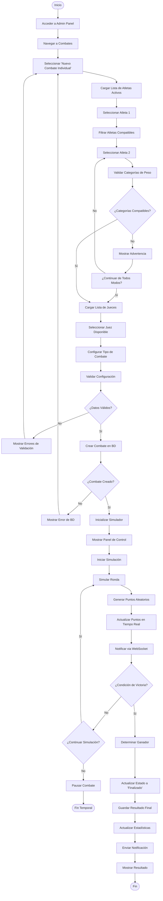
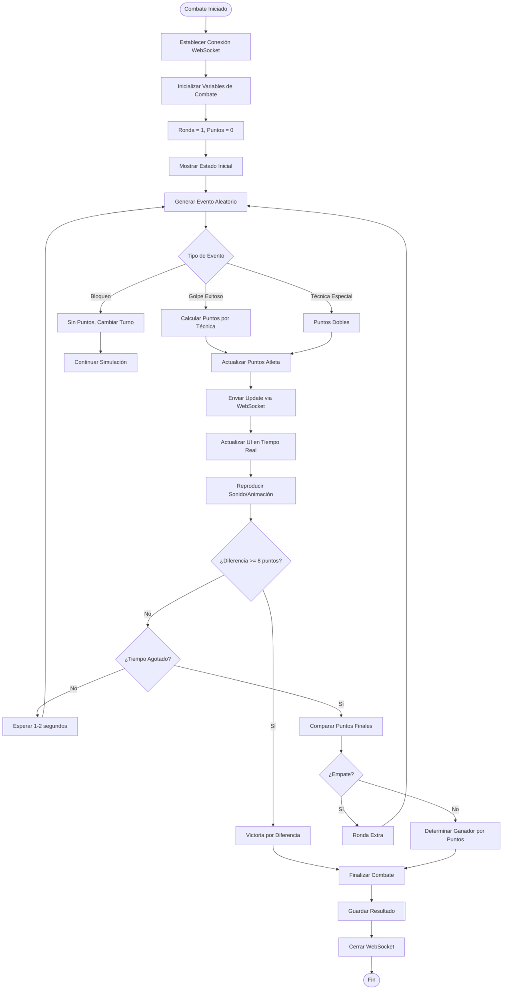
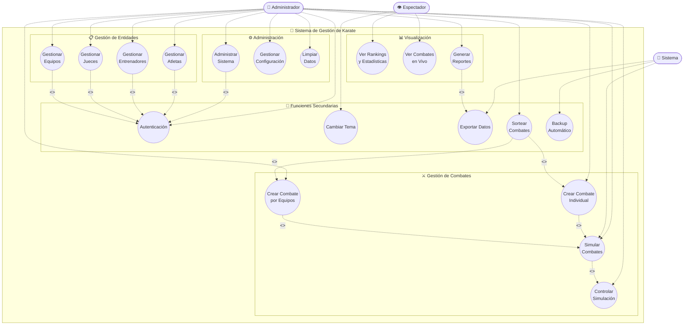
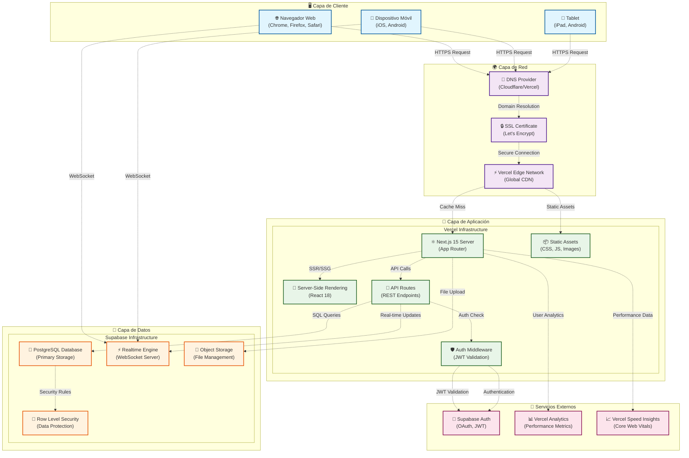

# Diagramas UML - Sistema de Gestión de Karate

## 📋 Descripción del Sistema

Este documento contiene la documentación completa de los **Diagramas UML** del Sistema de Gestión de Karate, una aplicación web moderna desarrollada por estudiantes de 8vo Semestre de Ing en Informatica .. sub-proyecto desarrollo de aplicaciones 2  .profesor Franklin españa .. unellez 2025 2026

### Sobre el Sistema
Sistema web integral de gestión para asociaciones de karate que permite:
- **Gestión de Entidades**: Administración completa de atletas, entrenadores, jueces y equipos
- **Gestión de Combates**: Creación y simulación de combates individuales y por equipos
- **Monitoreo en Tiempo Real**: Seguimiento de combates activos con actualizaciones instantáneas
- **Análisis y Reportes**: Rankings, estadísticas y reportes detallados

### Stack Tecnológico
- **Frontend**: Next.js 15, React 19, TypeScript, Tailwind CSS
- **Backend**: Supabase (PostgreSQL + Real-time + Auth)
- **Despliegue**: Vercel con Edge Network global
- **Características**: SSR/SSG, WebSockets, PWA-ready

### Propósito de este Documento
Este documento presenta cuatro tipos de diagramas UML que modelan diferentes aspectos del sistema:
1. **Diagramas de Clases**: Estructura estática del sistema
2. **Diagramas de Actividades**: Flujos de procesos y comportamientos
3. **Diagramas de Casos de Uso**: Interacciones entre actores y sistema
4. **Diagramas de Despliegue**: Arquitectura de infraestructura y componentes

---

## 📑 Tabla de Contenidos

1. [📐 Diagrama de Clases](#1--diagrama-de-clases)
   - [🎯 Entidades Principales del Dominio](#-entidades-principales-del-dominio)
   - [🔌 Capa de Acceso a Datos y Servicios](#-capa-de-acceso-a-datos-y-servicios)
   - [🎨 Componentes de Interfaz de Usuario](#-componentes-de-interfaz-de-usuario)

2. [🔄 Diagrama de Actividades](#2--diagrama-de-actividades)
   - [⚔️ Proceso de Gestión de Combate Individual](#️-proceso-de-gestión-de-combate-individual)
   - [📝 Proceso de Registro de Atleta](#-proceso-de-registro-de-atleta)
   - [⚡ Proceso de Simulación de Combate en Tiempo Real](#-proceso-de-simulación-de-combate-en-tiempo-real)

3. [🎭 Diagrama de Casos de Uso](#3--diagrama-de-casos-de-uso)
   - [👥 Actores del Sistema](#-actores-del-sistema)
   - [📊 Especificación Detallada de Casos de Uso](#-especificación-detallada-de-casos-de-uso)

4. [📦 Diagrama de Despliegue](#4--diagrama-de-despliegue)
   - [🏛️ Arquitectura de Infraestructura](#️-arquitectura-de-infraestructura)
   - [🔧 Especificaciones Técnicas del Despliegue](#-especificaciones-técnicas-del-despliegue)

5. [🛠️ Tecnologías Utilizadas](#️-tecnologías-utilizadas)

6. [✨ Características del Sistema](#-características-del-sistema)

---

## 1. 📐 Diagrama de Clases

El diagrama de clases muestra la estructura estática del sistema, incluyendo las entidades del dominio, sus atributos, métodos y relaciones.

### 🎯 Entidades Principales del Dominio

Estas clases representan los conceptos centrales del negocio: atletas, entrenadores, equipos, jueces y combates.

```mermaid
classDiagram
    class Atleta {
        -UUID id
        -string nombre
        -string apellido
        -string cedula
        -Date fecha_nacimiento
        -decimal peso
        -string categoria_peso
        -string cinturon
        -string foto_url
        -UUID equipo_id
        -boolean activo
        -DateTime created_at
        -DateTime updated_at
        +crearAtleta() Atleta
        +actualizarAtleta(datos) boolean
        +eliminarAtleta() boolean
        +obtenerAtletas() Atleta[]
        +obtenerPorId(id) Atleta
        +calcularEdad() int
        +validarPeso() boolean
    }

    class Entrenador {
        -UUID id
        -string nombre
        -string apellido
        -string cedula
        -int anos_experiencia
        -string especialidad
        -string telefono
        -string email
        -string foto_url
        -boolean activo
        -DateTime created_at
        -DateTime updated_at
        +crearEntrenador() Entrenador
        +actualizarEntrenador(datos) boolean
        +eliminarEntrenador() boolean
        +obtenerEntrenadores() Entrenador[]
        +validarExperiencia() boolean
    }

    class Equipo {
        -UUID id
        -string nombre
        -UUID entrenador_id
        -string descripcion
        -DateTime created_at
        -DateTime updated_at
        +crearEquipo() Equipo
        +actualizarEquipo(datos) boolean
        +obtenerEquipos() Equipo[]
        +obtenerAtletas() Atleta[]
        +contarMiembros() int
    }

    class Juez {
        -UUID id
        -string nombre
        -string apellido
        -string cedula
        -string nivel_certificacion
        -int anos_experiencia
        -string telefono
        -string email
        -boolean activo
        -DateTime created_at
        -DateTime updated_at
        +crearJuez() Juez
        +actualizarJuez(datos) boolean
        +eliminarJuez() boolean
        +validarCertificacion() boolean
        +puedeArbitrar(combate) boolean
    }

    class CombateIndividual {
        -UUID id
        -UUID atleta1_id
        -UUID atleta2_id
        -UUID juez_id
        -string estado
        -int puntos_atleta1
        -int puntos_atleta2
        -UUID ganador_id
        -string tipo_combate
        -DateTime fecha_inicio
        -DateTime fecha_fin
        -DateTime created_at
        +crearCombate() CombateIndividual
        +iniciarCombate() boolean
        +simularRonda() void
        +actualizarPuntos(atleta, puntos) void
        +finalizarCombate() void
        +determinarGanador() UUID
    }

    class CombateEquipo {
        -UUID id
        -UUID equipo1_id
        -UUID equipo2_id
        -UUID juez_id
        -string estado
        -int puntos_equipo1
        -int puntos_equipo2
        -UUID ganador_id
        -DateTime fecha_inicio
        -DateTime fecha_fin
        -DateTime created_at
        +crearCombateEquipo() CombateEquipo
        +iniciarCombate() boolean
        +simularCombate() void
        +calcularPuntosEquipo() int
    }

    %% Relaciones
    Entrenador ||--o{ Equipo : entrena
    Equipo ||--o{ Atleta : tiene
    Atleta ||--o{ CombateIndividual : participa
    Juez ||--o{ CombateIndividual : arbitra
    Equipo ||--o{ CombateEquipo : compite
    Juez ||--o{ CombateEquipo : arbitra
    CombateIndividual ||--|| Atleta : ganador
    CombateEquipo ||--|| Equipo : ganador
```

### 🔌 Capa de Acceso a Datos y Servicios

Estas clases manejan la comunicación con Supabase y encapsulan la lógica de acceso a datos.

```mermaid
classDiagram
    class SupabaseClient {
        -string url
        -string anonKey
        -PostgrestClient rest
        -RealtimeClient realtime
        +createBrowserClient() SupabaseClient
        +createServerClient() SupabaseClient
        +from(table) PostgrestQueryBuilder
        +auth() GoTrueClient
        +storage() StorageClient
    }

    class AtletaService {
        -SupabaseClient client
        +obtenerTodos() Promise~Atleta[]~
        +obtenerPorId(id) Promise~Atleta~
        +crear(atleta) Promise~Atleta~
        +actualizar(id, datos) Promise~boolean~
        +eliminar(id) Promise~boolean~
        +buscarPorCategoria(categoria) Promise~Atleta[]~
    }

    class CombateService {
        -SupabaseClient client
        +crearCombateIndividual(datos) Promise~CombateIndividual~
        +simularCombate(id) Promise~void~
        +obtenerCombatesActivos() Promise~CombateIndividual[]~
        +finalizarCombate(id) Promise~boolean~
    }

    class RealtimeService {
        -SupabaseClient client
        -RealtimeChannel channel
        +suscribirCombates(callback) void
        +enviarActualizacion(evento) void
        +desconectar() void
    }

    SupabaseClient ||--o{ AtletaService : utiliza
    SupabaseClient ||--o{ CombateService : utiliza
    SupabaseClient ||--o{ RealtimeService : utiliza
```

### 🎨 Componentes de Interfaz de Usuario

Componentes React que conforman la interfaz de usuario del sistema administrativo.

```mermaid
classDiagram
    class AdminLayout {
        -ReactNode children
        -string currentPath
        +render() JSX.Element
        +handleNavigation(path) void
    }

    class AtletaForm {
        -AtletaFormData formData
        -FormErrors errors
        -boolean isSubmitting
        +onSubmit(data) Promise~void~
        +validate(field) boolean
        +resetForm() void
        +render() JSX.Element
    }

    class AtletasTable {
        -Atleta[] atletas
        -string sortBy
        -string filterBy
        +onEdit(atleta) void
        +onDelete(id) void
        +onSort(column) void
        +onFilter(criteria) void
        +render() JSX.Element
    }

    class CombateSimulador {
        -CombateIndividual combate
        -boolean isSimulating
        -number currentRound
        +iniciarSimulacion() void
        +simularRonda() void
        +pausarSimulacion() void
        +finalizarCombate() void
        +render() JSX.Element
    }

    class ThemeProvider {
        -string theme
        -ThemeContext context
        +toggleTheme() void
        +setTheme(theme) void
        +render() JSX.Element
    }

    ThemeProvider ||--o{ AdminLayout : envuelve
    AdminLayout ||--o{ AtletaForm : contiene
    AdminLayout ||--o{ AtletasTable : contiene
    AdminLayout ||--o{ CombateSimulador : contiene
```

---

## 2. 🔄 Diagrama de Actividades

Los diagramas de actividades modelan los flujos de trabajo y procesos del sistema, mostrando la secuencia de acciones desde el inicio hasta la finalización de cada proceso.

### ⚔️ Proceso de Gestión de Combate Individual

Este diagrama muestra el flujo completo desde la creación de un combate hasta su finalización, incluyendo validaciones y simulación en tiempo real.



### 📝 Proceso de Registro de Atleta

Flujo detallado del proceso de alta de un nuevo atleta en el sistema, con todas las validaciones necesarias.

```mermaid
flowchart TD
    A([Inicio]) --> B[Acceder a Gestión de Atletas]
    B --> C[Hacer Click en 'Nuevo Atleta']
    C --> D[Cargar Formulario Vacío]
    D --> E[Ingresar Nombre y Apellido]
    E --> F[Ingresar Cédula]
    F --> G[Validar Cédula Única]
    G --> H{¿Cédula Disponible?}
    
    H -->|No| I[Mostrar Error: Cédula Existente]
    I --> F
    
    H -->|Sí| J[Ingresar Fecha de Nacimiento]
    J --> K[Calcular Edad Automáticamente]
    K --> L[Ingresar Peso Actual]
    L --> M[Determinar Categoría de Peso]
    M --> N[Seleccionar Cinturón]
    N --> O[Cargar Lista de Equipos]
    O --> P[Seleccionar Equipo (Opcional)]
    P --> Q[Subir Foto (Opcional)]
    Q --> R[Validar Todos los Campos]
    R --> S{¿Formulario Válido?}
    
    S -->|No| T[Mostrar Errores Específicos]
    T --> U[Resaltar Campos con Error]
    U --> V[Enfocar Primer Campo Inválido]
    V --> E
    
    S -->|Sí| W[Mostrar Confirmación]
    W --> X[Enviar Datos a Supabase]
    X --> Y{¿Guardado Exitoso?}
    
    Y -->|No| Z[Mostrar Error de Conexión]
    Z --> AA[Opción de Reintentar]
    AA --> X
    
    Y -->|Sí| BB[Revalidar Cache de Atletas]
    BB --> CC[Mostrar Mensaje de Éxito]
    CC --> DD[Redireccionar a Lista]
    DD --> EE[Resaltar Nuevo Atleta]
    EE --> FF([Fin])
```

### ⚡ Proceso de Simulación de Combate en Tiempo Real

Este diagrama detalla el motor de simulación que genera eventos aleatorios y actualiza los puntos en tiempo real mediante WebSockets.



---

## 3. 🎭 Diagrama de Casos de Uso

El diagrama de casos de uso identifica las funcionalidades del sistema desde la perspectiva de los usuarios (actores), mostrando qué puede hacer cada tipo de usuario y cómo interactúan con el sistema.

### 👥 Actores del Sistema
- **👤 Administrador**: Usuario con permisos completos para gestionar todas las entidades y configuraciones
- **👁️ Espectador**: Usuario que puede visualizar combates y estadísticas sin permisos de modificación
- **🤖 Sistema**: Procesos automáticos que se ejecutan sin intervención humana



### 📊 Especificación Detallada de Casos de Uso

A continuación se detallan los casos de uso más importantes del sistema con sus características principales.

#### 🏆 Casos de Uso Principales

**UC1 - Gestionar Atletas**
- **Actor Principal**: Administrador
- **Descripción**: CRUD completo de atletas con validaciones de datos
- **Precondiciones**: Usuario autenticado como administrador
- **Flujo Principal**: Crear, leer, actualizar y eliminar atletas
- **Postcondiciones**: Datos de atletas actualizados en la base de datos

**UC2 - Gestionar Entrenadores**
- **Actor Principal**: Administrador
- **Descripción**: Administración de entrenadores y sus especialidades
- **Incluye**: Validación de experiencia y certificaciones

**UC3 - Gestionar Jueces**
- **Actor Principal**: Administrador
- **Descripción**: Control de jueces y sus niveles de certificación
- **Incluye**: Validación de competencias para arbitrar

**UC4 - Gestionar Equipos**
- **Actor Principal**: Administrador
- **Descripción**: Creación y administración de equipos
- **Incluye**: Asignación de entrenadores y atletas

**UC5 - Crear Combate Individual**
- **Actor Principal**: Administrador
- **Descripción**: Configuración de combates 1 vs 1
- **Extiende**: UC7 (Simular Combates)
- **Incluye**: Validación de categorías de peso

**UC6 - Crear Combate por Equipos**
- **Actor Principal**: Administrador
- **Descripción**: Configuración de combates grupales
- **Extiende**: UC7 (Simular Combates)

**UC7 - Simular Combates**
- **Actor Principal**: Sistema/Administrador
- **Descripción**: Simulación automática en tiempo real
- **Incluye**: UC8 (Controlar Simulación)
- **Postcondiciones**: Resultado guardado y notificado

#### 📊 Casos de Uso de Visualización

**UC9 - Ver Rankings y Estadísticas**
- **Actor Principal**: Espectador/Administrador
- **Descripción**: Visualización de clasificaciones y métricas
- **Precondiciones**: Datos de combates disponibles

**UC10 - Ver Combates en Vivo**
- **Actor Principal**: Espectador
- **Descripción**: Seguimiento de combates activos en tiempo real
- **Tecnología**: WebSockets para actualizaciones en vivo

#### ⚙️ Casos de Uso Administrativos

**UC12 - Administrar Sistema**
- **Actor Principal**: Administrador
- **Descripción**: Panel de control administrativo general
- **Incluye**: UC15 (Autenticación)

**UC15 - Autenticación**
- **Actor Principal**: Todos los usuarios
- **Descripción**: Proceso de login y autorización
- **Tecnología**: Supabase Auth

**UC18 - Sortear Combates**
- **Actor Principal**: Administrador
- **Descripción**: Generación automática de enfrentamientos
- **Incluye**: UC5 y UC6 para crear los combates sorteados

---

## 4. 📦 Diagrama de Despliegue

El diagrama de despliegue muestra la arquitectura física del sistema, incluyendo los servidores, servicios, componentes de infraestructura y cómo se comunican entre sí.

### 🏛️ Arquitectura de Infraestructura

Este diagrama representa la arquitectura completa de despliegue en producción, desde los clientes hasta los servicios de backend.



### 🔧 Especificaciones Técnicas del Despliegue

Detalles técnicos de cada capa de la arquitectura de despliegue.

#### 🖥️ **Capa de Cliente**
- **Navegadores Soportados**: Chrome 90+, Firefox 88+, Safari 14+, Edge 90+
- **Dispositivos Móviles**: iOS 14+, Android 8+
- **Tecnologías**: HTML5, CSS3, JavaScript ES2022, WebSockets
- **PWA**: Service Workers para funcionalidad offline

#### 🌍 **Capa de Red y CDN**
- **DNS**: Cloudflare/Vercel DNS con propagación global
- **SSL/TLS**: Certificados automáticos Let's Encrypt
- **CDN**: Vercel Edge Network con 40+ ubicaciones globales
- **Cache**: Estrategia de cache inteligente para assets estáticos
- **Compresión**: Gzip/Brotli para optimización de transferencia

#### 🚀 **Capa de Aplicación (Vercel)**
- **Runtime**: Node.js 18+ con Next.js 15
- **Rendering**: Hybrid SSR/SSG/CSR según necesidades
- **API**: Serverless Functions con auto-scaling
- **Middleware**: Edge Runtime para autenticación
- **Build**: Automatic deployments desde Git
- **Regiones**: Despliegue multi-región automático

#### 💾 **Capa de Datos (Supabase)**
- **Base de Datos**: PostgreSQL 15+ con extensiones
- **Conexiones**: Connection pooling automático
- **Backup**: Backups automáticos diarios
- **Seguridad**: Row Level Security (RLS) habilitado
- **Real-time**: WebSocket server para actualizaciones live
- **Storage**: Object storage para archivos multimedia

#### 🔧 **Servicios Externos**
- **Autenticación**: Supabase Auth con OAuth providers
- **Analytics**: Vercel Analytics para métricas de uso
- **Monitoring**: Speed Insights para Core Web Vitals
- **Logs**: Structured logging con retention de 30 días

#### 📊 **Métricas de Rendimiento**
- **Tiempo de Carga**: < 2 segundos (First Contentful Paint)
- **Disponibilidad**: 99.9% uptime SLA
- **Escalabilidad**: Auto-scaling basado en demanda
- **Latencia**: < 100ms para consultas de base de datos
- **Throughput**: 1000+ requests/segundo por región

#### 🔒 **Seguridad**
- **HTTPS**: Forzado en todas las conexiones
- **Headers**: Security headers (CSP, HSTS, etc.)
- **Authentication**: JWT tokens con refresh automático
- **Authorization**: Role-based access control (RBAC)
- **Data Protection**: Encriptación en tránsito y reposo
- **Compliance**: GDPR ready con data residency options

---

## 🛠️ Tecnologías Utilizadas

Stack tecnológico completo del sistema organizado por capas.

### 🎨 **Frontend**
- Next.js 15 (App Router)
- React 19 con TypeScript
- Tailwind CSS + Radix UI
- Framer Motion (animaciones)
- Lucide React (iconos)

### ⚙️ **Backend**
- Supabase (BaaS)
- PostgreSQL con RLS
- Server Actions de Next.js
- Middleware de autenticación

### 💻 **Herramientas de Desarrollo**
- TypeScript para type safety
- ESLint para calidad de código
- PostCSS para procesamiento CSS
- Zod para validación de schemas

### 🚀 **Despliegue y Monitoreo**
- Vercel para hosting
- Vercel Analytics
- Git para control de versiones
- Supabase Dashboard para BD

---

## ✨ Características del Sistema

Resumen de las funcionalidades y características técnicas implementadas.

### **Funcionalidades Principales**
✅ Gestión completa de atletas, entrenadores y jueces  
✅ Sistema de equipos con asignación de entrenadores  
✅ Combates individuales y por equipos  
✅ Simulador de combates en tiempo real  
✅ Rankings y estadísticas automáticas  
✅ Panel administrativo completo  
✅ Autenticación y autorización  
✅ Tema claro/oscuro  
✅ Responsive design  

### **Características Técnicas**
✅ Server-Side Rendering (SSR)  
✅ Static Site Generation (SSG)  
✅ Real-time updates con Supabase  
✅ Type-safe con TypeScript  
✅ Componentes reutilizables  
✅ Validación de formularios  
✅ Manejo de errores robusto  
✅ Cache inteligente  
✅ SEO optimizado  

---

---

### 📝 Notas
- Todos los diagramas están en formato Mermaid para fácil visualización en GitHub y editores compatibles
- Los diagramas se actualizan conforme evoluciona el sistema
- Para sugerencias o correcciones, contactar al equipo de desarrollo

---

*© 2025 Sistema de Gestión de Karate - Equipo Dinamita .. desarrollo de aplicaciones 2 . profesor Fraklin españa Unellez *